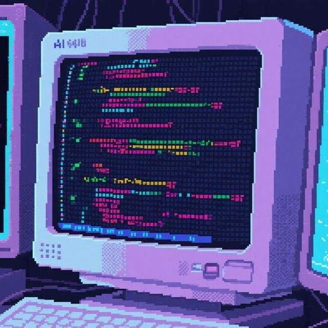
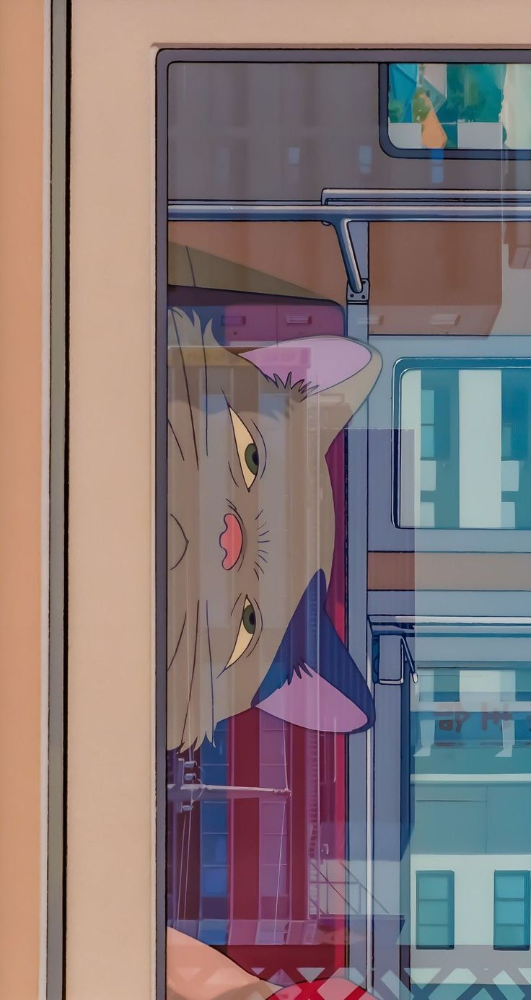

  

  
  

  I'm a web and application developer who is passionate about building the professional web experiences that customers need. I am very interested and eager to learn new technologies, improve my projects, and explore better ways to create comfortable and more engaging websites and applications. I believe in continuous learning, attention to detail, and the power of clean and meaningful design.

  
  
  
  

<h3>📚 About Me</h3>

- ⚡ I'm a Web and Application Developer | Software Engineer
- 🔬 Interested in IT World, Building systems, and AI
- 📊 Building The Professional Web Experiences That Customers Need
- 🌱 Growing through research, hands-on projects, and open-source learning
- 🧩 I enjoy breaking down complex problems into clear, practical, and maintainable solutions
- 🚀 Exploring Build Software & Systems That Can Change The World
- 📚 Continuously improving through projects, documentation, experiments, and collaboration

 

<h3>🌿 What I'm Building Toward</h3>

<table>
  <tr>
    <td width="50%" valign="top">
      <strong>🌱 Direction</strong>
      <ul>
        <li>Creating Professional Web Experiences That Satisfy Customer Needs</li>
        <li>Building software & systems that can change the world</li>
        <li>Improving through research, hands-on projects, and open-source learning</li>
      </ul>
    </td>
    <td width="50%" valign="top">
      <strong>🔭 Current Focus</strong>
      <ul>
        <li>Developing professional and scalable web applications that meet business needs</li>
        <li>Improving system quality and performance through research and best practices</li>
        <li>Creating meaningful and engaging user experiences</li>
      </ul>
    </td>
  </tr>
</table>

<h3>🧰 Tech Garden</h3>

  
  
  
  
  
  
  
  
  
  
  
  
  
  
  
  
  

<h3>🌲 Forest Activity</h3>

<table align="center">
  <tr>
    <td width="49%" valign="top">
      
    </td>
    <td width="2%"></td>
    <td width="49%" valign="top">
      
       
      
    </td>
  </tr>
</table>

